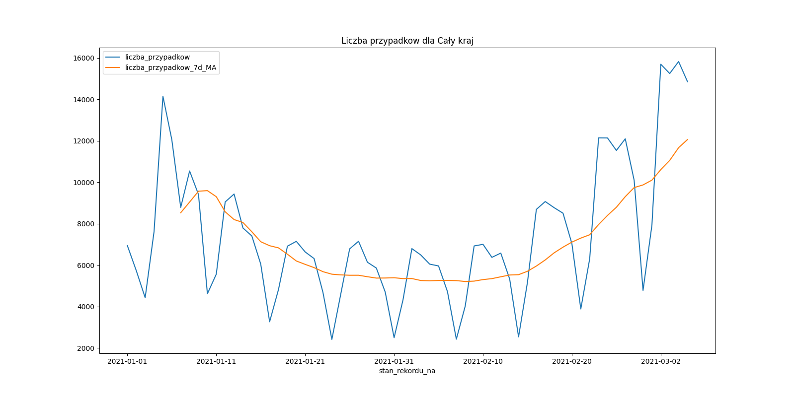
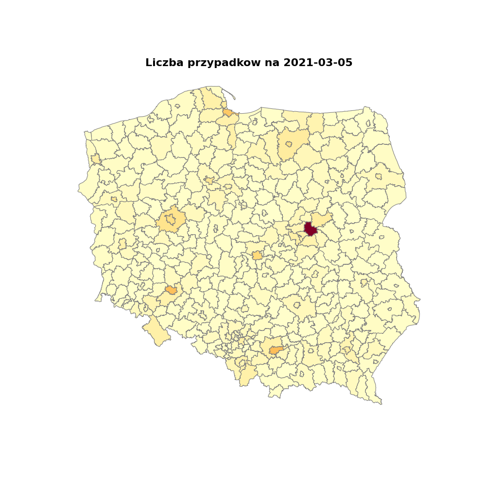

# Analyse COVID-19 situation in Poland
### Team: # jpydzr2-syntaxerror
Project start: Mar-2021

## Dataset

 - The COVID data comes from the [official govenment source](https://arcgis.com/sharing/rest/content/items/e16df1fa98c2452783ec10b0aea4b341/data)
 - The spatial data comes from the [GIS Support](https://www.gis-support.pl/downloads/Powiaty.zip) (consulting and programming company specializing in spatial data).

## 1st stage: CLI pplication
The main goal of the app is to collect, process and visualize the current COVID-19 situation in Poland per county. Right now, only two type of visualizations are available:

 1. a line chart with daily cases together with 7days moving average. The chart can be plotted per powiat (equivalent to a county). The default is set to 'Cały kraj' (eng. the entire country).
    
 2. a choropleth map for the last known date
    

## 2nd stage: GUI application
The 2nd stage assumes rebuilding the CLI app to the GUI app.

## 3rd stage: Web aplication
The 3rd stage assumes rebuilding the GUI app to the WEB app.
